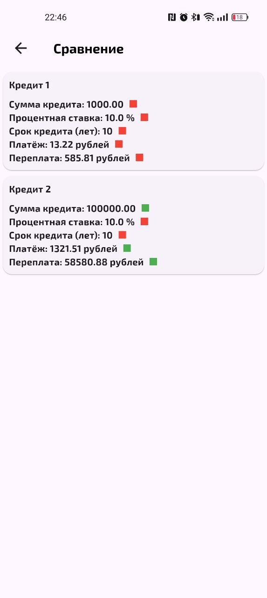
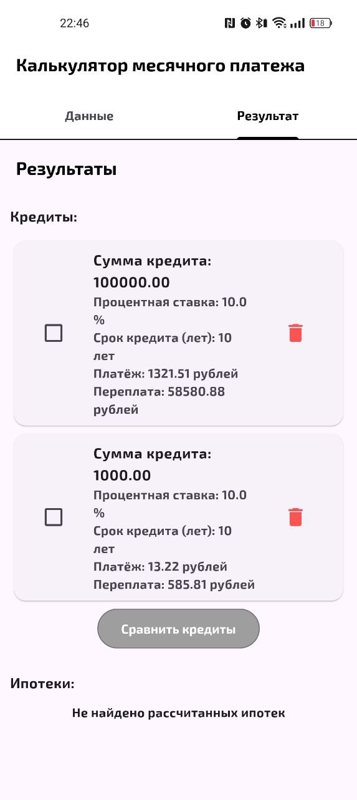

# Calculate Credits 🧮

Мобильное приложение для расчёта кредитов, разработанное на Flutter. Приложение помогает пользователям рассчитать ежемесячные платежи, общую сумму выплат и переплату по кредиту.

---

## 📱 О проекте

**Calculate Credits** — это удобное приложение для расчёта кредитов. Оно позволяет пользователям быстро и легко рассчитать параметры кредита, такие как ежемесячный платёж, общую сумму выплат и переплату, а также сравнить кредиты с различными условиями.

### Основные функции:
- Расчёт ежемесячного платежа по кредиту.
- Отображение общей суммы выплат и переплаты.
- Простой и интуитивно понятный интерфейс.

---

## 🛠️ Технологии

- **Язык программирования**: Flutter
- **Инструменты разработки**: Android Studio
- **Система управления версиями**: Git

---

## 🚀 Как запустить проект

### Требования:
- Android Studio (рекомендуется последняя версия).
- Устройство с Android или эмулятор.

### Шаги для запуска:
1. Склонируйте репозиторий:
   ```bash
   git clone https://github.com/MiWanya/Calculate_Credits.git
2. Откройте проект в Android Studio.
3. Подключите устройство или запустите эмулятор.
4. Нажмите Run в Android Studio, чтобы собрать и запустить приложение.

---

## 📸 Скриншоты

<div align="center">    </div>

### 📫 Связь
Если у вас есть вопросы или предложения, свяжитесь со мной:

Telegram: @MiWanya24

Email: miwanyalv@vk.com

VK: [MiWanya](https://vk.com/miwanyalv)
